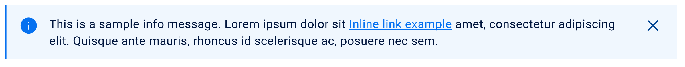
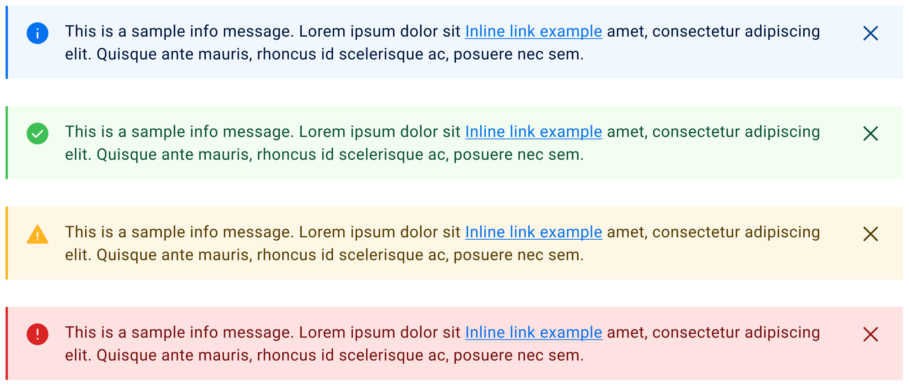
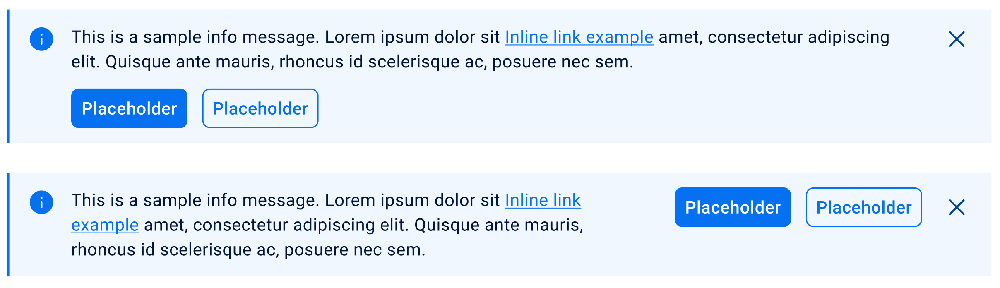
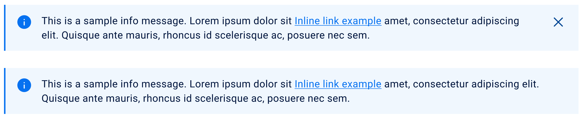

## Overview
Message bars are nonmodal semantic dialogs that can be displayed at the top of the page or contextually within a task flow.

## Guidelines
- Global message bars display nonmodal messages that inform users of updates or changes to system status.
- Contextual message bars are most often used in task flows and forms, providing users additional context or information about a task.
- Either can be used for critical system alerts or passive feedback.

## Modifiers
There are 3 modifiers that can be used to change the Message bar:
- Type: Information, Success, Warning, Error
- Buttons: Primary Bottom, Secondary Bottom, Primary Right, Secondary Right,
- Close icon: With close icon, without close icon

### Type
There are 4 types of Message bar
- Information
- Success
- Warning
- Error

### Buttons
Message bar can have a set of two buttons located at the bottom of the component or on the right side of the component. Buttons are available only on two types of Message bars: information and error

### Close icon
Message bars are available in dismissible and nondismissible options. For example, global message bars containing critical information should remain in view, and therefore be nondismissible by the user.

